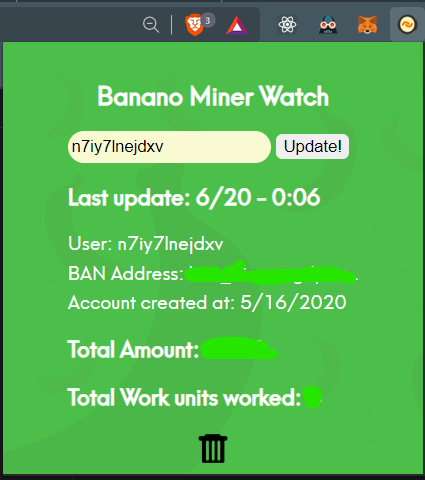

# Introduction to BananoMiner Watch V1.2.1 (soon to be V1.2.1.1)

BananoMiner Watch is a **Chrome Browser Extension** that shows you all the stats about your contributions to the [www.banano.cc team](https://stats.foldingathome.org/team/234980) at [Folding@home](https://foldingathome.org/) including the amount of $BAN you have already earned using your config from [https://bananominer.com/](https://bananominer.com/).

# How to install?

Due to (undocumented and irrational) technical limitations of the Google Chrome Webstore Version 1.2.1 could not be submitted for review and publication in the Google Chrome  Webstore.
Some minor adaptations will have to be carried out.
However, the extension is fully functional and available for your test and usage.
~~Version 1.2.1 has been submitted for review and publication in the Google Chrome  Webstore!~~
Until it´s available from there you can follow the steps below to use Version 1.2.1 of the extension already today.

*TL;DR Enable developer mode in Chrome Browser -> unzip this package then select the folder by clicking the load unpackaged in your chrome browser (works with brave browser too!)*

## Step 1 Download from github
 Download the latest release from [tags in the github](https://github.com/sebrock/bananominer-watch-DEV_TEST/releases) (Download ZIP)

## Step 2 Enable Developer Mode in Chrome
Go to [chrome extensions](chrome://extensions) or for [Brave Browser](brave://extensions).
Turn on the Developer Mode in the top left corner of the Extensions page in Chrome. 

## Step 3 Unzip the downloaded release package 
Unzip to a folder on your HDD. This folder will be the main folder you selct in step 4.

## Step 4 Load the extension into Chrome
You can now select the extension. That's pretty easy, you go to **load unpackaged**,  select the folder you unzipped to and that´s it!

## After install - How to use it
You will now see a Banano Logo In the upper right corner of Chrome, next to the address bar.
Click on it and you will see the extension window pop up.
Now it's easy, you enter your 7-character User ID from bananominer and click "Find me!".
You will now see all the stats about your contributions and your earnings.
Bonus feature: move your mouse over your BAN address and you will see the MonKey for your address!
To update your stats just click update.

## Credits
Our sincere thanks go to everyone in the BANANO community who contributed and supported in the making of this. BAN fam - best fam! 💛

# Translation and Proofreading
- AhmedDhaif93 for Arabic
- Goose for Chinese
- ATH for Dutch
- Liberty_Seed and iazid for French
- Pramono for Bahasa Indonesia
- Lore and macaleon for Italian
- Africa by Toto for Japanese
- mina_hanem for Farsi
- nknown for Potuguese
- MidNightSonne for Brazilian Portuguese
- YaroslavaWise for Russian
- Cristalla for Spanish
- bbedward for reminding the jungle to support 

# Graphic Design support
 - Oops

*That's it guys. If you need to talk with us you can find André on [twitter](https://twitter.com/andrecrjr) and both of us [andrecrjr](https://discordapp.com/users/2731
) and sebrock [sebrock|42 세브로크-마흔 둘](https://discordapp.com/users/4242) on the [Banano Discord Server](https://chat.banano.cc/).

Feel free to open Issues or improvents to the code (to a separate branch and create PRs towards the DEV_TEST master.

Made with 🧡 and potassium 🍌 in Brazil, Germany, and the BANANO Jungle.
