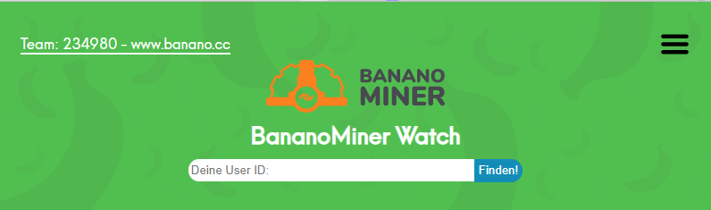
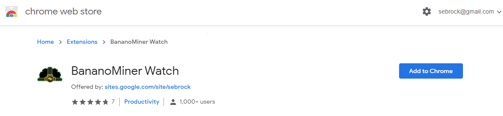
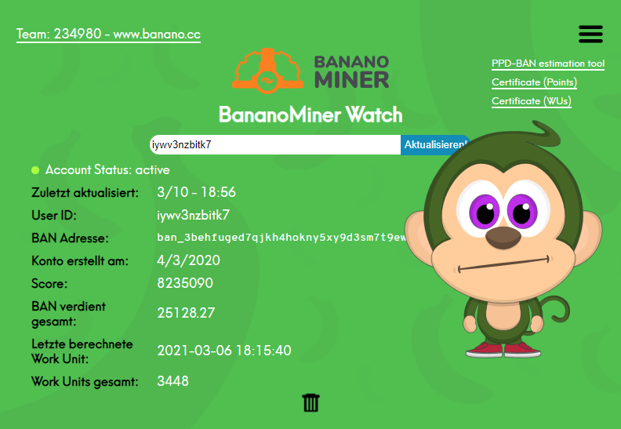
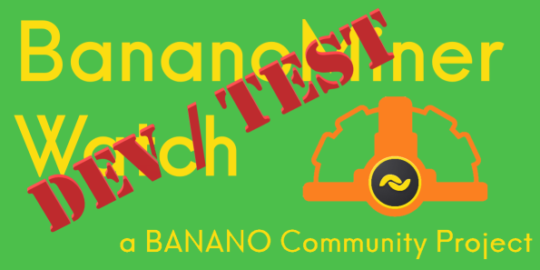

# Introduction to BananoMiner Watch V1.3.4 HOTFIX

# Temporary HOTFIX
This version is a HOTFIX (workaround) adressing issues where users could not see their stats or saw their account incorrectly marked as inactive

(pictured: German version)

BananoMiner Watch is a **Chrome Browser Extension** that shows you all stats about your contributions to the [www.banano.cc team](https://stats.foldingathome.org/team/234980) at [Folding@home](https://foldingathome.org/) including the amount of $BAN you have already earned using your config from [https://bananominer.com/](https://bananominer.com/).
If you want to learn more about how the Banano community is providing a valuable contribution to medical research you can check out [this article](https://www.publish0x.com/banano/heres-how-you-can-help-fight-coronavirus-and-youll-even-get-xmvdpq?a=QJ0dNjvdLO)

# How to install?

Version V1.3.3 мајмун has been published in the [Google Chrome  Webstore](https://chrome.google.com/webstore/detail/pdnkikfbjfhikkpopfoaihhfbhaplpfc?authuser=0&hl=en), is available for download in all regions, and in 20 different languages covering 21 locales (locale identifiers in brackets):
  -  Arabic (ar)
  -  Danish (da)
  -  German (de)
  -  Greek (el)
  -  English - default (en)
  -  Spanish (es)
  -  **NEW - Serbian (sr) - NEW**
  -  Latin Amrican Spanish (es_419)
  -  Persian (fa)
  -  French (fr)
  -  Hindi (hi)
  -  Bahasa Indonesia (id)
  -  Italian (it)
  -  Japanese (ja)
  -  Dutch (nl)
  -  Norwegian (no)
  -  Brazilian Portuguese (pt_BR)
  -  Portuguese (pt_PT)
  -  Russian (ru)
  -  Vietnamese (vt)
  -  Chinese - Mandarin (zh_CN)

# Want to test the latest Development build?

## Step 1 Download from github
 Download the latest dev build from [tags in github](https://github.com/sebrock/bananominer-watch-DEV_TEST/releases) (Download ZIP)

## Step 2 Enable Developer Mode in Chrome
Go to [chrome extensions](chrome://extensions) or for [Brave Browser](brave://extensions).
Turn on the Developer Mode in the top left corner of the Extensions page in Chrome. 

## Step 3 Unzip the downloaded release package 
Unzip to a folder on your HDD. This folder will be the main folder you select in step 4.

## Step 4 Load the extension into Chrome
You can now select the extension. That's pretty easy, you go to **load unpackaged**,  select the folder you unzipped to and that´s it!

## After install - How to use it
You will now see a Banano Logo in the upper right corner of Chrome, next to the address bar.
Click on it and you will see the extension window pop up.
Now it's easy, you enter your 7-character User ID from bananominer and click "Find me!".
You will now see all the stats about your contributions and your earnings.
Bonus feature: move your mouse over your BAN address and you will see the MonKey for your address!
To update your stats just click update.

(pictured: German version)

## Changelog

You can find the Changelog [here](./changelog.md)

## Credits
Our sincere thanks go to everyone in the BANANO community who contributed and supported in the making of this. BAN fam - best fam! 💛

# Translation and Proofreading

- AhmedDhaif93 for Arabic
- Goose for Chinese
- Kryptopia for Danish
- ATH for Dutch
- Liberty_Seed and iazid for French
- sebrock for German
- Demetrius for Greek
- Skittish for Hindi
- Pramono for Bahasa Indonesia
- Lore and macaleon for Italian
- Africa by Toto for Japanese
- mina_hanem for Farsi
- nknown for Portuguese
- pygo for Norwegian
- MidNightSonne and andrecrjr for Brazilian Portuguese
- YaroslavaWise and Nomina for Russian
- KyleLondon92 meow! for Serbian
- Cristalla for Spanish
- Tahadorukk | Guns'NRoses for Turkish
- Tu Hoang for Vietnamese
- bbedward for reminding the jungle to support

# Graphic Design support
 - Oops

# March 2021 Hotfix help provided by
 - [heanzyzabala](https://github.com/heanzyzabala)

*That's it guys. If you need to talk to us you can find us on Twitter:
- [André´s twitter](https://twitter.com/andrecrjr)
- [sebrock´s twitter](https://twitter.com/sebrock)
- or both of us on the [Banano Discord Server](https://chat.banano.cc/)
andrecrjr / sebrock|42 

# Contribution Guide
Feel free to open Issues for bugs, feature requests, improvents to the code in [https://github.com/sebrock/bananominer-watch-DEV_TEST/](https://github.com/sebrock/bananominer-watch-DEV_TEST/).
Please commit to a separate branch and create PRs towards the DEV_TEST master.

Made with 🧡 and potassium 🍌 in Brazil, Germany, and the BANANO Jungle.
